# ios打包

## 流程
- 打开目录，找到xcodeproj文件
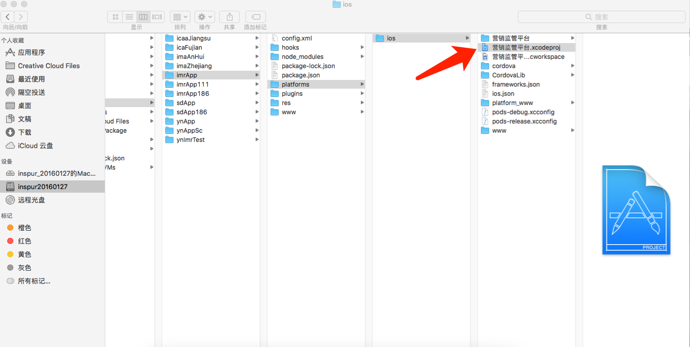

- 双击xcodeproj文件，修改版本号，配置证书
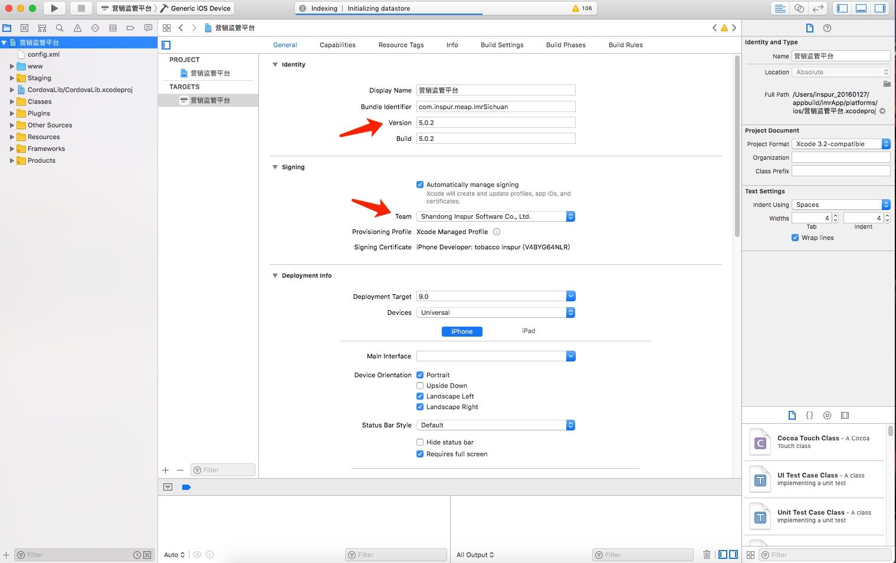

- 配置signing为ios developer
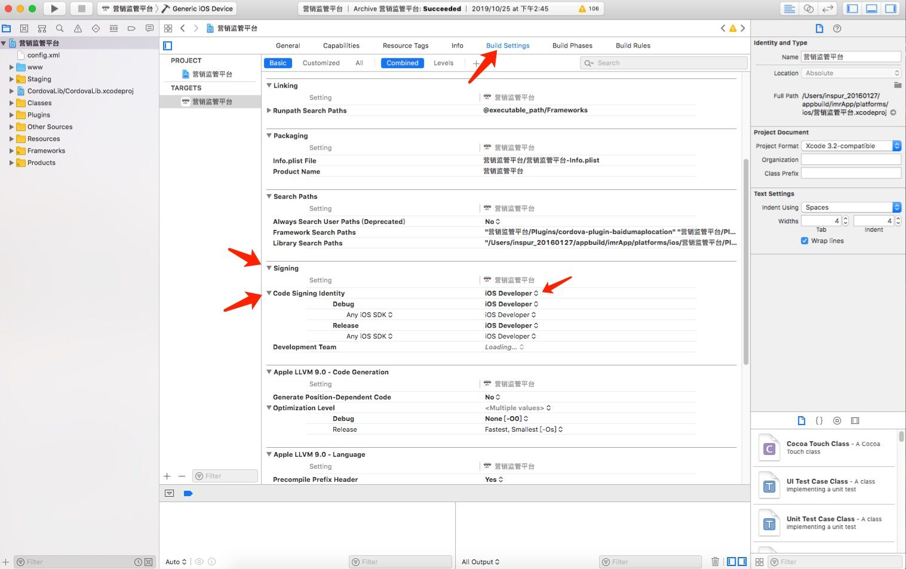

- 根据需求，选择安装到已连接手机|打包|运行ios虚拟机
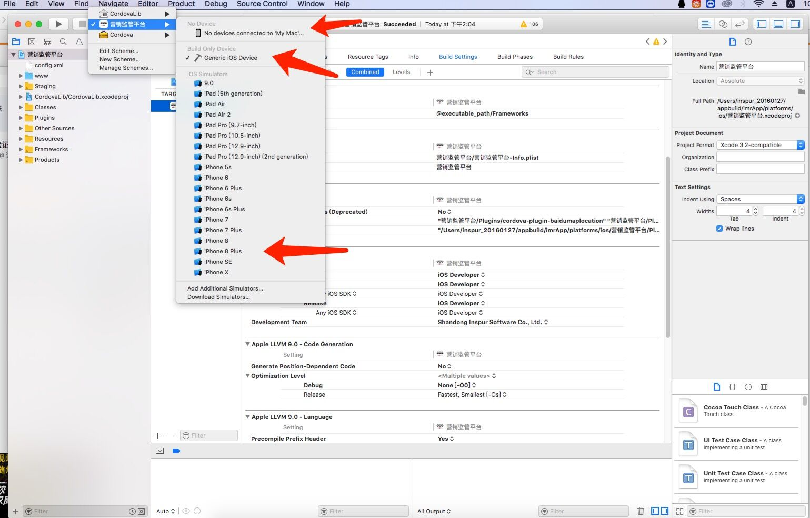

- 执行打包
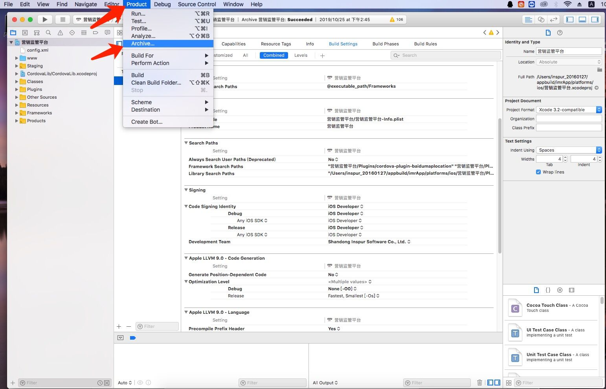

- 点击export
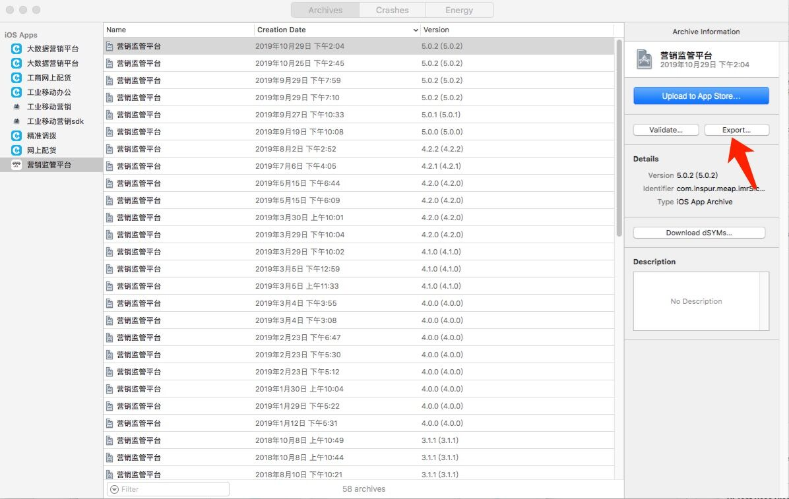

- 选择enterprise，下一步
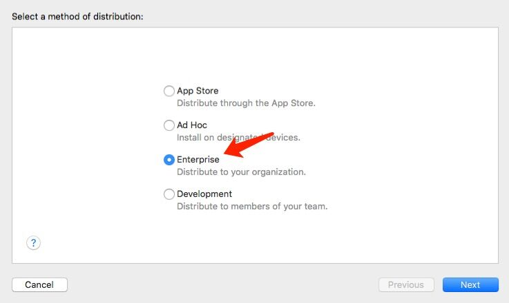

- 选择All compatible device variants，下一步
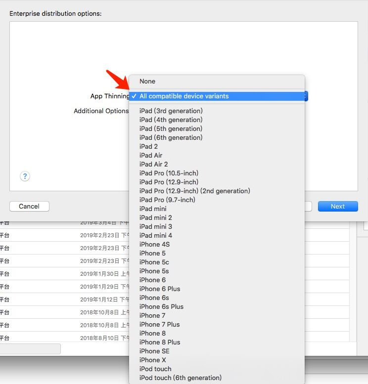

- automatically manager signing，下一步
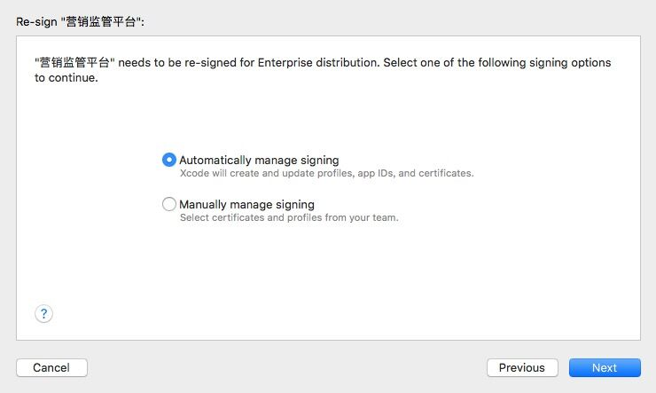

- 导出（这里有个过期时间需要注意下，过期之后app不再可用）
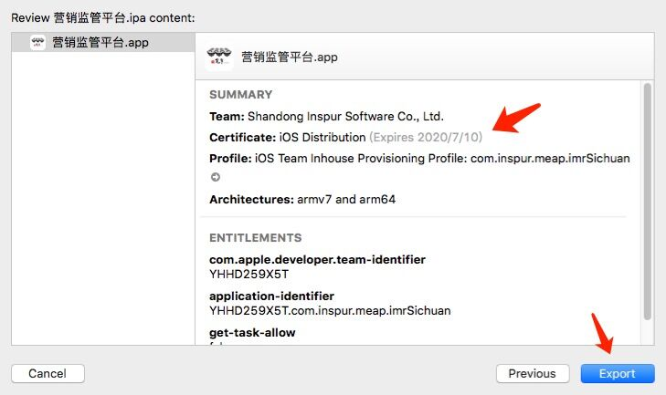

- 选择目录
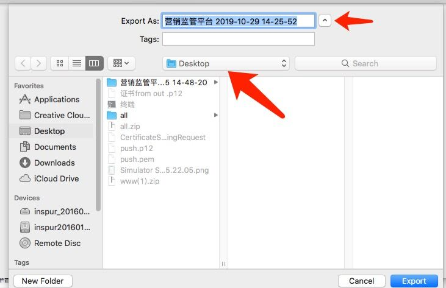